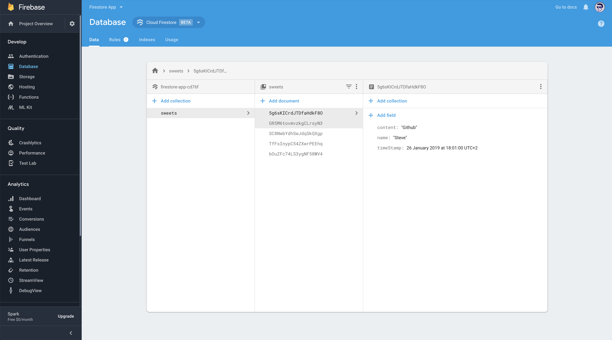
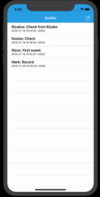

# SwifferMSG

### Simple App like Twitter

###### I create a simple app like Twitter using cloud database Firestore from Google. The file `GoogleService-info.plist` don't exist in my project. You have to make the database and download the file.

### Things that i Used:

+ `Add Data`
+ `AlertController`
+ `Perform simple queries`
+ `Listen realtime updates`
---

###### My Firestore

---

###### Sample of the app.

